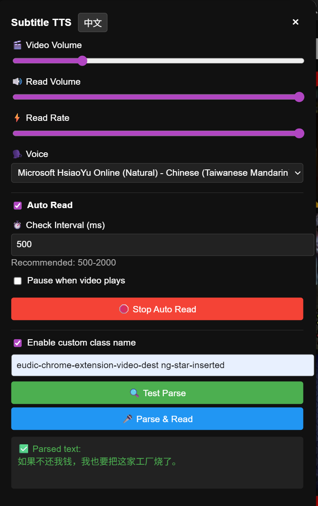
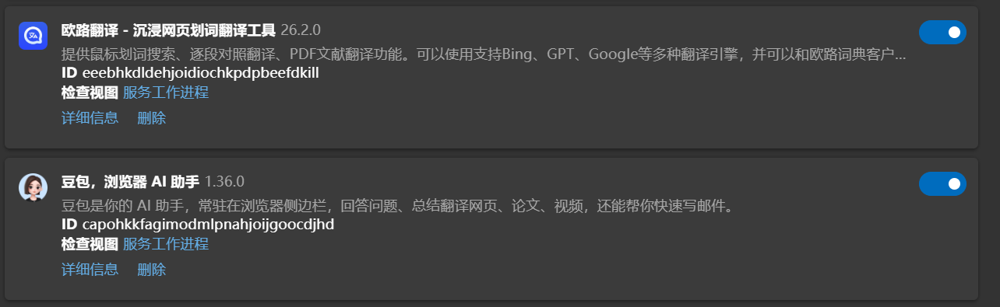
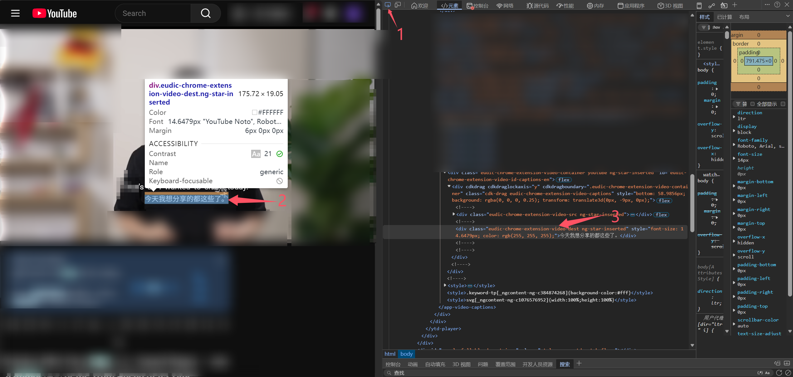

# YouTube Subtitle TTS

[**中文版**](README.zh-CN.md) | English

A Tampermonkey/Greasemonkey userscript that automatically detects and reads YouTube subtitles using browser text-to-speech (TTS). Designed for multi-line translated subtitle scenarios.

## Features

- **Custom Class Selector**: Parse subtitles by specifying CSS class names (supports multiple classes)
- **Auto-Read Mode**: Automatically detects subtitle changes and reads them aloud
- **TTS Controls**: Adjust volume, rate, and voice selection
- **Video Volume Control**: Separate control for video volume
- **Smart Detection**: Only reads when subtitle text changes (avoids repetition)
- **Auto-Stop**: Optionally pause reading when video is playing
- **Shadow DOM Support**: Can search within shadow DOM elements

## TTS Recommendation

> **💡 Tip: Use Local TTS for Better Experience**
>
> Remote TTS services often introduce latency that can negatively impact your listening experience. We recommend using local browser TTS (which this script uses by default) or other local TTS solutions for optimal performance and minimal delay.
>
> **🎤 Got a Great TTS Recommendation?**
>
> If you've found an excellent TTS service or solution, please share it with the community! Open an issue or PR to let others know about your discovery. Your recommendation could help many users find their perfect voice solution.

## Installation

1. Install [Tampermonkey](https://www.tampermonkey.net/) (Chrome/Edge) or [Greasemonkey](https://www.greasespot.net/) (Firefox)
2. Click "Raw" on `TTS.js` and install the userscript
3. Open any YouTube video page

## Usage

### Getting Subtitle Class Names

1. Install a translation extension (e.g., "Language Reactor" or similar)

   I recommend this:
   

2. Open a YouTube video with subtitles

3. Press F12 to open Developer Tools

   

4. Use the element picker to select a subtitle element

5. Right-click → Copy → Copy selector, or manually copy the class names

6. Example class names: `translated_subtitle-AHVt79 has_corner-hLvKLd`

### Configuration

1. Click the 📢 button in YouTube's video player controls
2. Check "Enable custom class name"
3. Paste the subtitle class names (space-separated)
4. Configure TTS settings:
   - Video volume
   - Read volume
   - Read rate
   - Voice selection (Chinese voices)
5. Enable auto-read mode if desired

### Auto-Read Mode

- Enable "Auto-read function" checkbox
- Set detection interval (500-2000ms recommended)
- Option: "Pause auto-read when video is playing"

## Controls

| Button | Function |
|--------|----------|
| 📢 | Open/close subtitle TTS panel |
| 🔍 Test Parse | Manually parse subtitles to verify configuration |
| 🎤 Parse and Read | Parse current subtitle and read aloud |
| ▶️ Start Auto-Read | Enable automatic subtitle reading |
| 🛑 Stop Auto-Read | Disable automatic subtitle reading |

## Technical Details

- Uses `window.speechSynthesis` API for TTS
- Filters voices to show only Chinese/Chinese-related voices
- Stores configuration in Tampermonkey's storage (`GM_setValue`/`GM_getValue`)
- Runs at `document-idle` to ensure page elements are loaded
- Supports both normal DOM and shadow DOM element queries

## Troubleshooting

- **No text parsed**: Verify class names using Developer Tools
- **Auto-read not working**: Ensure "Enable custom class name" is checked and class names are valid
- **Voice not available**: Check browser language settings for Chinese voice support
- **Shadow DOM elements**: The script attempts to search shadow DOM automatically

## Version

Current version: `0.2.0-alpha`

## License

MIT License

## Author

NameZH131 - [GitHub](https://github.com/NameZH131)

## Support

- [Issues](https://github.com/NameZH131/youtube TTS/issues)
- [Homepage](https://github.com/NameZH131/youtube TTS)